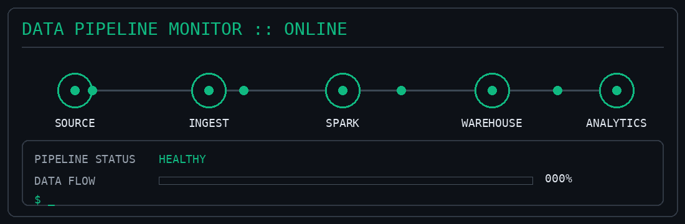

# 📟 Terminal Summary 

<div align="center">

<a href="https://dhananjaykharkar.tech">

</a>

<br><br>


</div>

---

# 👋 Hi, I'm **Dhananjay Gajanan Kharkar**

### **Data Engineer | Python • SQL • PySpark • AWS • Snowflake • Airflow**

I'm a **B.Tech Artificial Intelligence graduate** focused on **Data Engineering** and building reliable data pipelines.

My core stack includes **Python, SQL, PySpark, AWS, Apache Airflow, Docker, and Snowflake**.

I'm interested in **data processing, cloud data engineering, data warehousing, pipeline orchestration, and scalable data systems**.

---

<div align="center">



</div>

---

## 🛰️ What I Do

```text
┌──────────────┐
│ Data Sources │
└──────┬───────┘
       ↓
┌──────────────┐
│  Ingestion   │
└──────┬───────┘
       ↓
┌──────────────┐
│  Processing  │
│   PySpark    │
└──────┬───────┘
       ↓
┌──────────────┐
│Transformation│
└──────┬───────┘
       ↓
┌──────────────┐
│   Storage    │
│  Snowflake   │
└──────┬───────┘
       ↓
┌──────────────┐
│  Analytics   │
└──────────────┘
```

* 🔄 Build **ETL / ELT data pipelines**
* ⚡ Work with **PySpark** for data processing
* ☁️ Build pipelines using **AWS data services**
* 🗄️ Work with **Snowflake and SQL** for analytical workloads
* 🔄 Orchestrate workflows using **Apache Airflow**
* 🐳 Use **Docker** for containerized environments
* 🧹 Work with structured and semi-structured data

---

## 💻 Technical Arsenal

### 🐍 Programming & Data Processing

<a href="https://www.python.org/">

</a>
<a href="https://www.postgresql.org/">

</a>
<a href="https://spark.apache.org/">

</a>

### ☁️ AWS

<a href="https://aws.amazon.com/s3/">

</a>
<a href="https://aws.amazon.com/lambda/">

</a>
<a href="https://aws.amazon.com/glue/">

</a>
<a href="https://aws.amazon.com/athena/">

</a>

### 🗄️ Data Warehousing

<a href="https://www.snowflake.com/">

</a>

### ⚙️ Orchestration & DevOps

<a href="https://airflow.apache.org/">

</a>
<a href="https://www.docker.com/">

</a>

---

## 🎯 Currently Focused On

* ⚡ **PySpark & distributed data processing**
* ☁️ **AWS Data Engineering**
* 🗄️ **Snowflake & Data Warehousing**
* 🔄 **Airflow & pipeline orchestration**
* 🏗️ **Data pipeline architecture**
* 📈 **Scalable data processing**
* 🤖 **Data Engineering for AI systems**

---

## 🤖 Data Engineering + AI

With a background in **Artificial Intelligence**, I'm also interested in how data engineering supports modern AI systems.

```text
          Raw Data
             │
             ▼
     Data Engineering
             │
      Clean & Reliable
             │
             ▼
        AI Systems
```

My interest is particularly around **data pipelines, data quality, large-scale processing, and the data infrastructure behind AI applications**.

---

## 🌱 Career Goal

Building my career as a **Data Engineer** and growing toward designing **scalable, reliable, and production-ready data platforms**.

---

## 📡 Connect

<div align="center">

<a href="https://linkedin.com/in/dhananjaykharkar">

</a>

<a href="mailto:dkharkar00@gmail.com">

</a>

</div>

<br>

<div align="center">


</div>
